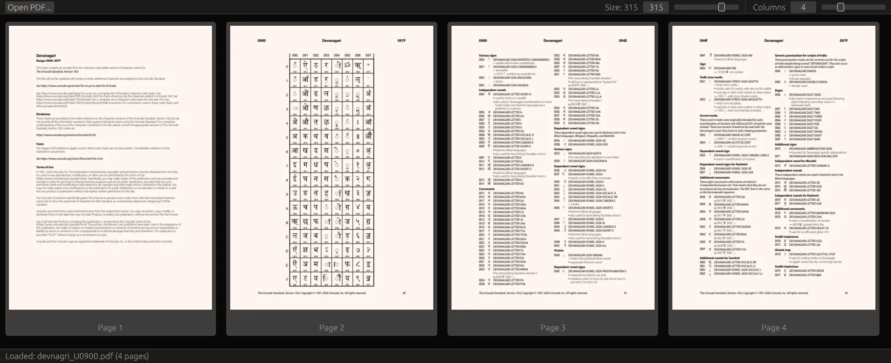
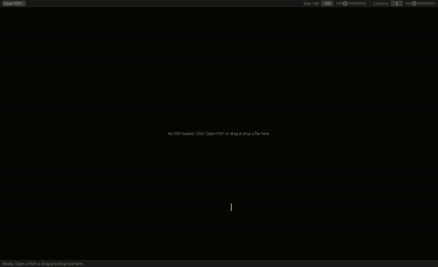

# pdf-arranger-clone

Clone of [pdf-arranger](https://github.com/pdfarranger/pdfarranger) - Small python-gtk application, which helps the user to merge or split PDF documents and rotate, crop and rearrange their pages using an interactive and intuitive graphical interface.

This tool is rust-based using Egui & [PDFium](https://github.com/bblanchon/pdfium-binaries)


## Project Ideation and TODOs
### Rendering flow

```text
PDF file
   ↓
PDFium / MuPDF / Poppler
   ↓
RGBA bitmap
   ↓
thumbnail cache
   ↓
GUI texture
```

### Export flow

```text
Project.pages
   ↓
Load source PDF pages
   ↓
Copy pages in project order
   ↓
Apply page rotation
   ↓
Write output PDF
```

Do not export through PNG files. That would remove selectable text, vector graphics, links, annotations, and document metadata.

## Suggested `Cargo.toml`

A practical first version using `egui`, PDFium, and `lopdf`:

```toml
[package]
name = "pdf-arranger"
version = "0.1.0"
edition = "2021"

[dependencies]
anyhow = "1"
thiserror = "2"

# GUI
eframe = "0.33"
egui = "0.33"

# PDF rendering and thumbnails
pdfium-render = "0.9"

# Image conversion and thumbnail encoding
image = "0.25"

# PDF structure manipulation
lopdf = "0.36"

# IDs for pages and documents
uuid = { version = "1", features = ["v4"] }

# File dialogs
rfd = "0.15"

# Optional: background jobs and channels
crossbeam-channel = "0.5"

[profile.release]
opt-level = 3
lto = true
codegen-units = 1
```

`pdfium-render` provides high-quality page rendering, while `lopdf` works with PDF objects and document structure. They serve different purposes and are useful together. <citation src="1,3"></citation>

## Suggested module layout

```text
src/
├── main.rs
├── app.rs                 # GUI application state
├── model/
│   ├── mod.rs
│   ├── project.rs         # Project and PageItem
│   └── commands.rs        # Move, delete, rotate, duplicate
├── pdf/
│   ├── mod.rs
│   ├── renderer.rs        # PDF → thumbnail
│   ├── exporter.rs        # Project → output PDF
│   └── cache.rs           # Thumbnail cache
├── ui/
│   ├── toolbar.rs
│   ├── thumbnail_grid.rs
│   └── dialogs.rs
└── history.rs             # Undo/redo
```

## PDF tool comparison

| Tool | Rust interface | Rendering | Page manipulation | Native dependency | Recommended use |
|---|---|---:|---:|---:|---|
| `pdfium-render` | High-level Rust wrapper | Excellent | Some | PDFium | Thumbnails, previews, viewers |
| `pdfium` | Lower-level PDFium binding | Excellent | Some | PDFium | Direct PDFium integration |
| MuPDF bindings | Rust bindings | Excellent | Good | MuPDF | Fast rendering and compact viewers |
| Poppler | Usually via FFI or CLI | Excellent | Limited | Poppler | Linux-oriented applications |
| `lopdf` | Pure Rust | No renderer | Good | None | PDF objects, splitting, metadata |
| `pdf-writer` | Pure Rust | No | Creates PDFs | None | Generating new PDFs |
| `printpdf` | Pure Rust | No | Creates PDFs | None | Simple PDF generation |
| `pdf-extract` | Pure Rust | No | No | None | Text extraction |
| `pdf2image`/CLI tools | External process | Good | Limited | External tools | Quick prototypes |

### `pdfium-render`

Best default for your application.

Advantages:

- Good rendering quality.
- Handles complicated PDFs better than a hand-written parser.
- Suitable for thumbnails and page previews.
- Good fit for zooming and PDF viewer features.

Disadvantage:

- Requires a compatible PDFium shared library or bundled binary.

### Suggested Development Milestones
* **Milestone 1:** Open a single PDF file using file dialogs and the project model.
* **Milestone 2:** Render page previews and thumbnails using `pdfium-render`.
* **Milestone 3:** Build the UI grid to display pages and handle basic user selection.
* **Milestone 4:** Implement core document model actions: reordering, deletion, duplication, and rotation.
* **Milestone 5:** Export the arranged project back to a PDF using a tested page-copy/merge implementation (`lopdf`).
* **Milestone 6:** Scale up the application to handle multiple input PDFs simultaneously.

---
---
## Features and milestones achieved so far, along with the upcoming tasks on your roadmap:

### Achieved Milestones & Features

* **Milestone 1: File Loading & Ingestion**
* Implemented native file dialogs (`rfd`) and drag-and-drop file inputs to load PDF documents.
* Extracted page counts successfully using `lopdf`.


* **Milestone 2: PDF Rendering Engine**
* Built the `PdfRenderer` module utilizing `pdfium-render` and local dynamic libraries.
* Converted individual PDF pages into dynamic image thumbnails.


* **Milestone 3: UI Thumbnail Grid & Layout**
* Created a scrollable thumbnail grid UI supporting single and multi-page selections.
* Implemented texture caching to efficiently handle memory and rendering performance.
* Added customizable column counts and dynamic thumbnail sizing controls via top-panel sliders.
* Integrated a bottom status bar providing real-time rendering progress feedback when opening large PDF files.
* Pinned the vertical scroll bar flush to the right border of the application window.


---

### Todo List / Upcoming Milestones

* **Milestone 4: Document & Page Manipulation**
* Implement page reordering.
* Implement page deletion.
* Implement page duplication.
* Implement page rotation.


* **Milestone 5: PDF Export**
* Bundle and export the arranged project layout back into a standalone PDF file using `lopdf`.


## Current Status
- Open pdf file or drag-n-drop
- Thumbnail of each pages
- Change thumbnail column
- Change thumbnail size


### Screenshots

- 


- 
